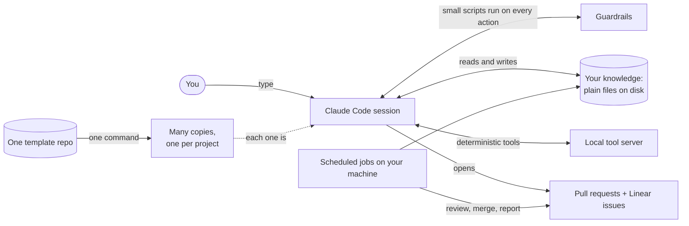
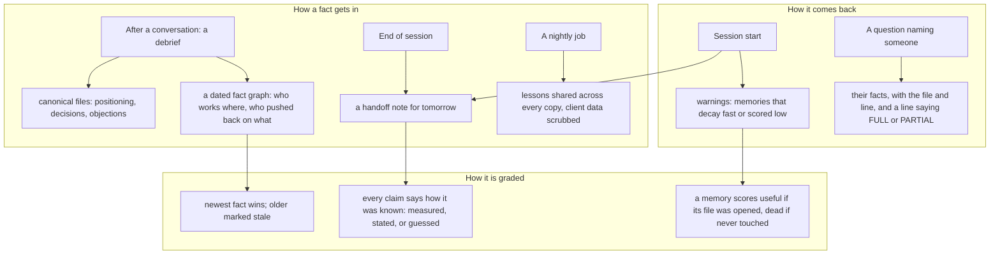
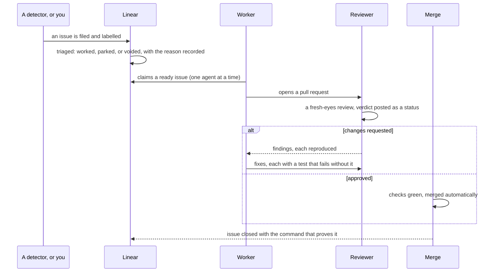
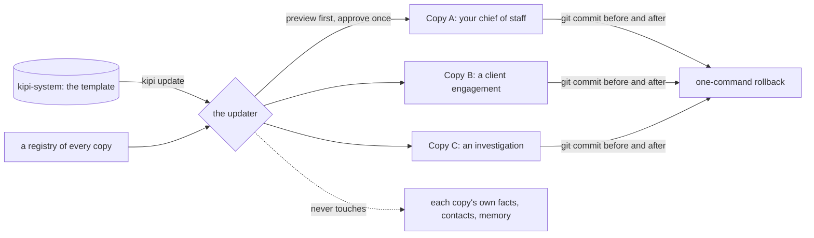

# The Kipi System

**Your AI brain. Externalized.**

It remembers everything you do. Then it becomes whatever you need.

Today it might run as your chief of staff. Tomorrow your lawyer. Next week your investigator. Same system, different role, because it remembers every decision, every conversation, every project you've ever brought it.

It runs in Claude Code. Plain markdown all the way down. No vector database, no embeddings, no black box. You read it with `cat`, search it with `rg`, version it with `git`.

---

## The whole thing in one picture



You type into a Claude Code session. Before, during and after every action, small scripts
called hooks run: they add context the AI would otherwise forget, they block actions that
would break a rule, and they record what happened. The session reads and writes plain
files that hold what you know. A local tool server gives the AI checks that return the
same answer every time. Work leaves through pull requests and issues, where scheduled jobs
review, merge and report without you in the loop. All of it lives in one template
repository and is copied to every project you run.

---

## The five ideas

**1. Assume the AI is unreliable.** It invents facts, forgets what it read, agrees with
whoever is talking, and says "done" before anything ran. Nothing here makes it accurate.
Everything here makes its mistakes findable, so a wrong answer leaves a trail and a right
one carries its evidence.

**2. Files are receipts.** A chat transcript is folklore with a timestamp. A file can be
opened tomorrow, searched by a script, diffed, and dated. If you told the system something
and it did not make it into a file, it does not exist the next morning.

**3. Guardrails, not reminders.** A reminder is a sentence the AI is supposed to remember.
A guardrail is a script that runs whether or not anyone remembers. Anything a script can
check is checked by a script that can say no.

**4. You are never the next step.** Engineering signals go to a queue an agent drains. You
decide three things: publish, spend, delete. Everything else has a machine that owns it.

**5. One skeleton, many instances.** Improvements are made once and fanned out. Each copy
keeps its own facts; the template owns the machinery.

---

## What happens in one turn

```mermaid
sequenceDiagram
    participant Y as You
    participant S as Session
    participant H as Hooks
    participant A as AI
    Y->>S: open a session
    H-->>S: yesterday's handoff, open follow-ups, lessons learned, memories to doubt
    Y->>S: ask a question
    H-->>S: your writing voice if you are drafting; your own facts if you named a person or client
    S->>A: question plus that context
    A->>S: wants to edit a file or run a command
    alt a rule would break
        H-->>A: refused, with the reason
    else allowed
        S->>S: the tool runs
        H-->>A: findings on what was written, or nothing
    end
    A->>S: finishes
    H-->>A: refused if the answer claims something never checked
    H-->>S: commit the work, score the memories, log the effort
```

When you open a session, hooks put yesterday's handoff, your open follow-ups and the
lessons the whole fleet has learned in front of the AI. When you ask something, they add
your writing voice if you are drafting and your own facts if you named a person, a client
or a capability. Before a tool runs, a hook can refuse it. After a file is written, checks
run on it. When the AI finishes, a last check can refuse the answer itself if it asserts
something it never opened. Then the work is committed and the session is scored.

---

## What it remembers, and how it grades itself



Facts enter through a debrief after a conversation, through the end-of-session handoff,
and through a nightly job that turns each copy's learnings into shared lessons with client
data removed. They come back at session start and again when a question names something
the system knows. And they are graded on their own: a newer fact supersedes an older one,
a handoff line must say whether it was measured or guessed, and a memory that never gets
used stops being trusted. The first line of any answer about a person or client says
`COVERAGE: FULL` or `COVERAGE: PARTIAL` and names what could not be searched. "I did not
find it" and "I never looked there" are different sentences, and the system says which.

---

## How work leaves without you



Issues arrive from detectors or from you and are labelled so a machine-filed issue is
distinguishable from a human one. A triage pass records a decision on each so the board
does not only grow. A worker claims an issue under a lock, does the work on a branch and
opens a pull request. A reviewer that has never seen the code reads the diff and posts a
verdict. Fixes carry a test that fails without them. When every check is green, it merges
itself. Red states have machine consumers; when they cannot cope, a ticket says so in an
agent's queue, not yours.

---

## One template, many copies



Every project is a full copy with its own facts and the same machinery. The updater
previews exactly what would be copied and removed per copy, waits for one approval, then
fans the machinery out and leaves each copy's facts untouched. It commits before and after
so any sync can be reverted alone. A copy with uncommitted work refuses the sync rather
than committing someone else's changes.

---

## Six real deployments

All six share the same skeleton. They differ only in their canonical content.

- **Chief of staff.** Tracks conversations, talk tracks, decisions, positioning. Drafts updates, debriefs, follow-ups.
- **PM for a client engagement.** Coordinates multiple projects, logs every decision, drafts deliverables, tracks stakeholder context.
- **Lawyer.** Generates separation packages, contract redlines, compliance memos. Citations to relevant code on every position.
- **Investigator.** Manages active OSINT cases, evidence artifacts, published intel reports.
- **Operator for a consulting business.** Pipeline tracking, content cadence, deliverable production.
- **Architect for itself.** Manages its own PRDs, issues, reviews. The system builds the system.

---

## Read the full explanation

[docs/README.md](docs/README.md) is the book. Six short pages for anyone, each with a
drawing and a "what this means for you" section. Fifteen deeper pages, one per part of
the system, each with two drawings and every script listed with what it does and the
mistake that made it exist. Generated catalogs of every tool, hook, job and rule. And a
coverage check that fails, naming the gap, if any part of the code is missing from the
docs, so the book cannot quietly fall behind.

---

## Install

```bash
npm install -g @anthropic-ai/claude-code
git clone https://github.com/assafkip/kipi-system.git
cd kipi-system && claude
```

Setup walks you through who you are, what you work on, how you write, and who you know. Takes about 20 minutes. After that the system runs.

---

## Commands

Optional. Most usage is just talking to the system in Claude Code.

| Command | What it does |
|---|---|
| `/q-debrief` | Extract insights from a conversation or paste a transcript |
| `/q-draft` | Quick email, DM, or content draft in your voice |
| `/q-engage` | Generate engagement on someone else's post |
| `/q-research` | Citation-only research mode |
| `/q-morning` | The day brief: one message with your calendar, mail needing an answer, and your board |
| `/q-wrap` | End-of-day health check |
| `/q-handoff` | Save context for next session |
| `/wiring-check` | End-of-task gate: prove every change is connected |

---

## Connects to

Works standalone with local files. Each integration adds capability.

| Tool | Adds |
|---|---|
| Notion | CRM, project tracking |
| Google Calendar | Meeting detection, auto-prep |
| Gmail | Email monitoring |
| Linear | Issue tracking, the autonomous work queue |
| Slack | The morning brief |
| Chrome (DevTools MCP) | Web automation, LinkedIn |
| Apify | X/Twitter scraping |
| Reddit | Search and post tracking |

---

## ADHD-aware, not ADHD-only

I have AUDHD. Some design choices reflect that. Friction-ordered actions. No shame language. Effort tracking. Decision elimination. If you have executive function challenges, the system removes a lot of cognitive load by default.

If you don't, you still get an AI that doesn't make you decide who to contact, what order to do things in, or how to phrase the message.

---

## Security

- `.env`, credentials, and key files blocked from read/write
- PreToolUse hooks intercept dangerous operations
- No secrets in committed files
- `rm -rf`, `sudo`, `git push --force` denied by default; the fleet-wide sync needs an out-of-band approval

---

## Origin

I'm [Assaf Kipnis](https://www.linkedin.com/in/assafkipnis/). 12 years in threat intelligence at LinkedIn, Google, Meta, and ElevenLabs. I burned out fighting the same problems over and over. Left corporate. Started [KTLYST](https://ktlystlabs.com), a security product that turns threat reports into governed, deployable artifacts.

Running a company solo with ADHD meant my brain couldn't hold everything it needed to hold. So I built a second one. It manages my work, writes in my voice, remembers what I forget, and compounds what I learn.

Right now it runs as six different roles across my work. This repo is the general-purpose version. Fork it and teach it yours.
