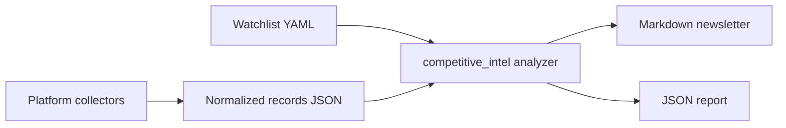

# Competitive Intel Analyst

This is the clean extraction of the Strategy and ASK competitive intelligence
pieces into one runnable workflow.

## What Exists Now

- Strategy has the six-platform sourcing agent:
  `/Users/assafkipnis/projects/ktlyst-hub/strategy/q-system/.q-system/agent-pipeline/agents/05-lead-sourcing.md`
- Strategy has deterministic Reddit collection:
  `/Users/assafkipnis/projects/ktlyst-hub/strategy/q-ktlyst/.q-system/scripts/reddit-fetch.py`
- Strategy has market signal scoring examples:
  `/Users/assafkipnis/projects/ktlyst-hub/strategy/vc_signals_bot_prompt.md`
- ASK has richer source strategy docs:
  `/Users/assafkipnis/projects/ASK_AI_consultant/q-consult/my-project/lead-sources.md`
  and `/Users/assafkipnis/projects/ASK_AI_consultant/q-consult/my-project/icp-signals.md`
- ASK has deterministic Reddit ICP monitoring:
  `/Users/assafkipnis/projects/ASK_AI_consultant/q-consult/.q-system/scripts/icp-signal-reddit.py`
- ASK and `kipi-system` share the reusable harvest layer under
  `plugins/kipi-core/kipi-mcp`.

## Runnable Workflow

From `plugins/kipi-core/kipi-mcp`:

```bash
PYTHONPATH=src uv run kipi-competitive-intel \
  --watchlist examples/competitive-intel/watchlist.yaml \
  --records examples/competitive-intel/records.json \
  --output /tmp/competitive-intel-newsletter.md \
  --report-json /tmp/competitive-intel-report.json \
  --week 2026-W26
```

The output is a Markdown newsletter that highlights repeated themes across watched
entities and lists the supporting source records.

For the AI builds radar:

```bash
PYTHONPATH=src uv run kipi-competitive-intel weekly \
  --watchlist examples/competitive-intel/ai-builds-watchlist.yaml \
  --raw-records examples/competitive-intel/ai-builds-raw-records.json \
  --output-dir ../../../q-system/output \
  --run-date 2026-06-30 \
  --week 2026-W27
```

That writes:

- `../../../q-system/output/competitive-intel/2026-06-30.md`
- `../../../q-system/output/competitive-intel/2026-06-30.records.json`
- `../../../q-system/output/competitive-intel/2026-06-30.report.json`

For a live keyless run that collects public AI signals first:

```bash
PYTHONPATH=src uv run kipi-competitive-intel collect-weekly \
  --watchlist examples/competitive-intel/ai-builds-watchlist.yaml \
  --sources-config examples/competitive-intel/ai-live-sources.json \
  --output-dir ../../../q-system/output \
  --query "AI agent eval harness MCP Claude Code" \
  --per-source-limit 5
```

This writes the raw collection, normalized records, structured report, and
newsletter under `../../../q-system/output/competitive-intel/`.

## Input Contract

Watchlist YAML:

- `name`: report name
- `min_entities_for_move`: defaults to 2
- `theme_keywords`: map of theme to keyword list
- `entities`: watched brands, influencers, retailers, founders, or accounts

Records JSON:

- required: `entity`, `source`, `text`
- optional: `source_id`, `url`, `published_at`, `author`, `engagement`

Raw records JSON can also come directly from harvest-style outputs. The normalizer
accepts records with `source_name`, `record_key`, `summary`, or `summary_json` and
maps common AI discovery feeds into newsletter entities:

- GitHub trending/new repos -> `GitHub Trending`
- Reddit AI communities -> `Reddit AI Builders`
- Hacker News builder chatter -> `Hacker News AI Builders`
- arXiv papers -> `AI Research Papers`
- X/Twitter builder chatter -> `Builder Thread`
- Substack/Medium research posts -> `AI Research Writers`
- YouTube build demos -> `YouTube AI Builders`

## Random-Stuff Extraction Notes

The live collector reuses the safe parts of the existing AI news podcast ingestor
in `/Users/assafkipnis/projects/random-stuff-ideas/gtm/scripts/podcast`:

- `sources.json` provides the source strategy: HN, Reddit, RSS feeds, Hugging
  Face, maker release feeds, and AI lab feeds.
- `fetch_sources.py` provides the important operational lessons: stdlib-friendly
  fetches, one dead source skips, Reddit via `/.rss` plus a browser UA, and dated
  sources over undated GitHub trending HTML.
- X is ported through the same Apify actor pattern from random-stuff:
  `apidojo/tweet-scraper`, named handles, retweet skip, and per-author caps.
- The podcast-specific pieces are intentionally not ported: launchd, Slack/email,
  NotebookLM audio, dedup ledger, and pool buffer.

## Architecture



## Next Build Step

Wire the existing `kipi_harvest` stored records into the normalized records JSON.
That keeps live scraping separate from analysis, so Apify, Reddit, Chrome, and
future YouTube/Instagram/TikTok collectors can evolve without changing the
newsletter engine.
